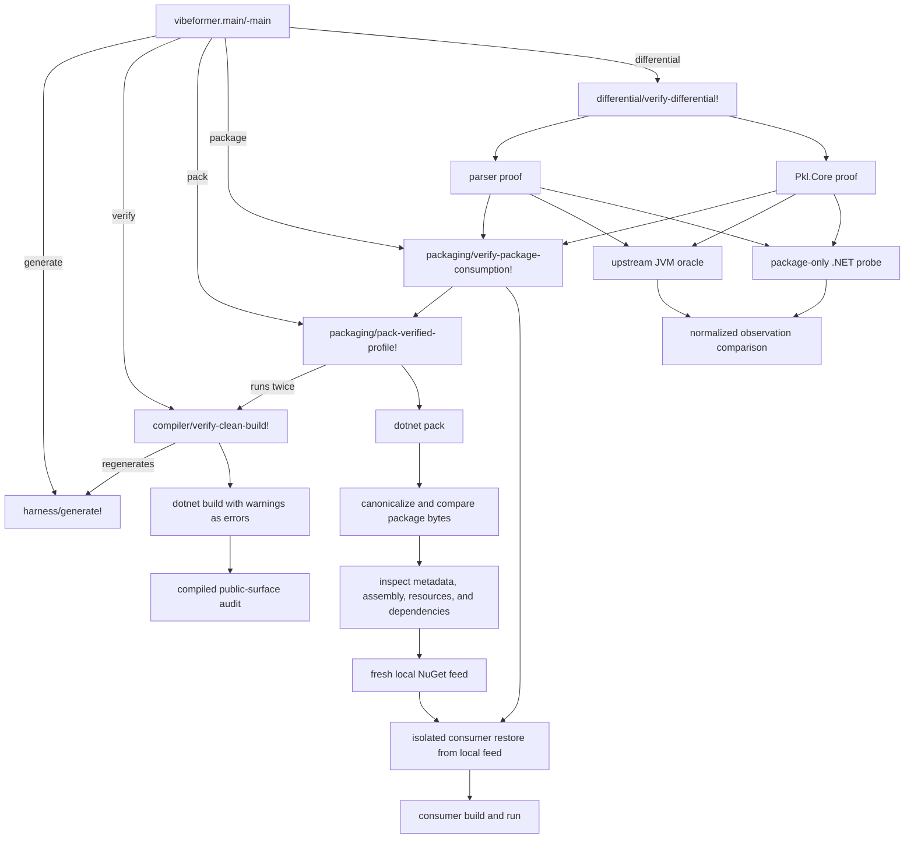
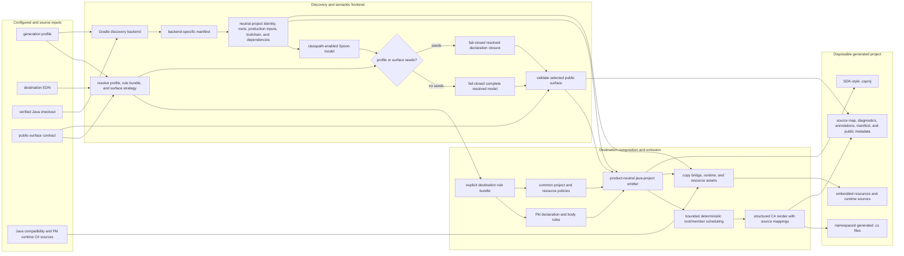
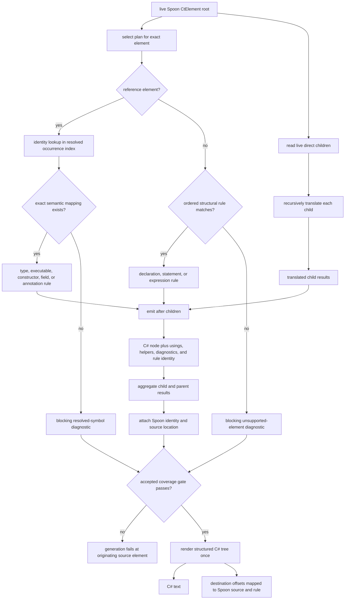

# Architecture

## Goal

Vibeformer is a reusable Java-to-C# source translator. Pkl is its first
product target and requirements driver, not a reason to make the translator
Pkl-specific. The Pkl source is in `../research/pkl`; do not modify it.

The Pkl product boundary is defined by its
[Authoritative Product Goal](targets/pkl/product-goal.md) and
[Port Scope](targets/pkl/port-scope.md). Other product targets define their own
contracts under [`targets/`](targets/). Temporary sequencing and status belong
in Beads, not in this document.

## Code-Derived System Views

These views follow the executable call paths and data structures in the
Clojure source. They describe the current implementation rather than an
intended future decomposition.

### Command Orchestration and Proof Ladder

The CLI commands are cumulative. Generation is the base operation; compilation,
packing, isolated consumption, and differential comparison add successively
stronger proof around a freshly generated project.



This composition is implemented by
[`vibeformer.main`](../src/vibeformer/main.clj),
[`vibeformer.compiler`](../src/vibeformer/compiler.clj),
[`vibeformer.packaging`](../src/vibeformer/packaging.clj), and
[`vibeformer.differential`](../src/vibeformer/differential.clj).

### Source-to-Project Generation

`harness/generate!` coordinates configuration, source discovery, semantic
resolution, public-surface checks, and deterministic project emission. The
resolved model retains live Spoon objects all the way into translation.



The orchestration and boundaries above come from
[`vibeformer.harness`](../src/vibeformer/harness.clj),
[`vibeformer.project`](../src/vibeformer/project.clj),
[`vibeformer.project-input`](../src/vibeformer/project_input.clj),
[`vibeformer.spoon`](../src/vibeformer/spoon.clj),
[`vibeformer.java-project`](../src/vibeformer/java_project.clj), and the
[`vibeformer.pkl.java-project`](../src/vibeformer/pkl/java_project.clj) rule
bundle. Destination files such as
[`pkl-parser.edn`](../config/pkl-parser.edn) select the bundle and output
contract explicitly.

### Recursive Translation Kernel

The translation kernel has two dispatch mechanisms over the same live Spoon
tree. Reference elements use exact resolved identities; other elements use the
first matching ordered structural rule. Both paths produce structured C# nodes,
and missing coverage becomes a blocking diagnostic rather than guessed output.



The reusable traversal and fail-closed gate are in
[`vibeformer.java-translate`](../src/vibeformer/java_translate.clj); the
structured writer is [`vibeformer.csharp`](../src/vibeformer/csharp.clj).
For the Pkl destination,
[`vibeformer.pkl.java-body`](../src/vibeformer/pkl/java_body.clj) constructs the
structural and semantic registries from the resolved model, while declaration
emission remains composed through the rule bundle shown above.

## Primary Pipeline

```text
resolve projects, source sets, generated sources, and dependencies
  -> validate a deterministic build-tool-neutral Java project input
  -> build a typed semantic AST with resolved symbols
  -> recursively translate declarations, statements, and expressions
  -> map resolved source symbols to .NET equivalents
  -> request focused compatibility/runtime support only when necessary
  -> emit complete disposable C# projects
  -> compile
  -> compare behavior independently
  -> fix the translator or runtime boundary and regenerate from scratch
```

For Java, Spoon's resolved model is the semantic AST. Translation walks that
model directly. Vibeformer must not reconstruct a second partial AST in a
database or reparse source text to translate constructs already represented by
Spoon.

Kotlin-to-C# translation is not part of the product goal. Kotlin source or tests
may be consulted as behavior evidence for an in-scope Pkl capability, but the
capability is implemented through Java translation or directly for .NET rather
than through a Kotlin frontend.

## Durable Assets

Generated C# is disposable. Durable assets are:

1. Original Java source used for translation and any upstream sources or tests
   used as behavior references.
2. Project and semantic-resolution configuration.
3. Recursive translators.
4. Resolved-symbol mapping registries.
5. Focused compatibility and destination-runtime source.
6. Independent behavior tests and compiler regressions.
7. Source mappings and diagnostics produced during translation.

Generated output must never require manual patches. A failure is fixed in
resolution, a mapping, a transform, project emission, or the focused runtime
boundary, then the output is regenerated.

## Semantic Resolution Requirement

Accepted translation requires the real project classpath, generated sources,
and dependency information. Source references must resolve to their actual
types, overloads, constructors, fields, and generic arguments.

No-classpath parsing may diagnose incomplete inputs, but it is not sufficient
for product emission. Unresolved symbols, ambiguous overloads, and fallback
types block accepted output.

## Recursive Translation

The normal case is intentionally simple:

```text
class       -> translate its members
method      -> translate its parameters, return type, and body
block       -> translate each statement
if          -> translate condition, then branch, and else branch
invocation  -> translate target and arguments, then apply a resolved-method map
type        -> translate type arguments, then apply a resolved-type map
```

Each translation result may include a C# node or text, required usings,
compatibility-helper requests, diagnostics, source mapping, and rule identity.
Children are translated recursively from the frontend model.

## Reusable Translation and Runtime Boundary

Ordinary Java language behavior and standard-library APIs should map to
normal C# and existing .NET facilities. Do not introduce a parallel JVM runtime
when .NET already provides suitable semantics.

The product-neutral recursive dispatch and resolved-symbol registry live in
`vibeformer.java-translate`. Product rule bundles depend inward on that kernel;
the Pkl body, declaration, destination, and runtime-bridge rules live under
`vibeformer.pkl.*`. Generic namespaces must not depend on a product bundle.
Future Java targets supply their own structural and semantic registries to the
same kernel instead of inheriting Pkl source identities or `Pkl.Core`
destinations.

Native .NET code is appropriate only when generated C# and existing .NET APIs
cannot faithfully provide the required behavior. Native replacements must be:

* Limited to missing JVM, GraalVM, Truffle, or source-product semantics.
* Isolated behind explicit capability boundaries.
* Implemented as reviewable C# source, not escaped C# embedded in Clojure.
* Independently tested against upstream behavior.
* Generalized when the capability is useful to other migrations.

Pkl-specific evaluator semantics belong in the Pkl destination runtime, not in
the reusable Java analyzer or emitter. The Pkl execution substrate will
need a focused .NET replacement for behavior supplied by Truffle, while normal
collections, I/O, URIs, reflection, concurrency, and similar platform APIs
should use .NET wherever practical.

## Validation

Compilation is necessary but not sufficient:

```text
generated project -> dotnet build
packed package     -> independent consumer
source behavior    -> compare with generated-package behavior
```

Product tests must be independent of the implementation generator. Upstream Pkl
tests and fixtures are authoritative behavior evidence for the in-scope .NET
library.

## First Architectural Proof

The first proof for the new pipeline is the complete `pkl-parser` Java module:

* Resolve the full module and its classpath.
* Translate all reachable declarations and bodies through the typed Spoon AST.
* Build the generated C# parser without manual output edits.
* Compare parser behavior with upstream Pkl.

This is an architectural proof, not a narrowing of the Pkl product goal.
